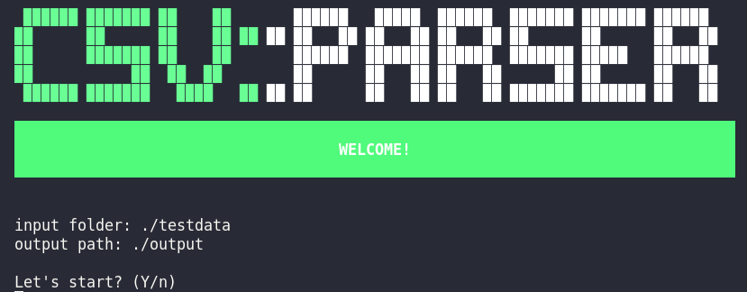
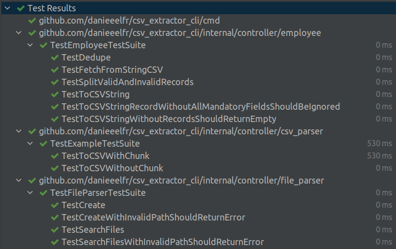
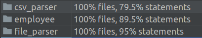
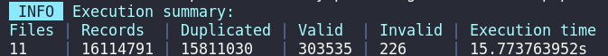

# CSV PARSER CLI-TOOL 


## Challenge Description

Your job is to create a **parser written** in Golang that can read these files and standardize the data to be processed at a later time.

Your code should follow best practices and be clean, well-organized, and bug free. The solution should be scalable, flexible and simple enough to address the requirements we are defining. Please review the useful links below.

## Basic Requisites 

1. Parse files
2. Flag any data problems.
3. Output a summary in the console
4. Generate two csv files, one for correct data, one for bad data.
5. Project must support Golang 1.16+ with go modules support.

## Other Requirements
1. Unit tests or automated tests
2. In the README file, explain your chosen architecture, why do you think it is a good fit for this problem and how you would evolve your submitted code.

## Required data:

- Employee name
- Employee salary
- Employee email
- Employee ID
  
#### ***Emails must be unique**
#### ***Assume files should be processed one at a time**

_______________
_______________
_______________
_______________
_______________
# Solution


## Development environment
#### Building the application
```bash
go build -o ./csv_extractor cmd/main.go
```
#### Running the source code tests
```bash
go test -v -cover -covermode=atomic ./...
```


)

#### Running the application help
```bash
.csv_extractor -h

  -input_path string
         (default "./testdata")
  -output_path string
         (default "./output")
```

#### Running the application (example)
```bash
go run csv_extractor -input_path=./testdata -output_path=./output
```

#### Execution summary example 


### Perfomance, Profiling and Refactor
#### Profiling **round 1** (10 files with 6+ millions of records [+350MB])
- [cpu_profiling_r1](assets/profiling/round1/cpu.pdf)
- [mem_profiling_r1](assets/profiling/round1/mem.pdf)

some small refactors got nice results (not enough yet):
#### Profiling **round 2** (11 files with 16+ millions of records [+850MB])
- [cpu_profiling_r2](assets/profiling/round2/cpu.pdf)
- [mem_profiling_r2](assets/profiling/round2/mem.pdf)


#### My choices
- I chose to build this tool on CLI format to keep it simple and focused on the data extraction, dedupe, and standardization.  
- The directory structure is based on [this pattern](https://github.com/golang-standards/project-layout).
- The library [split_csv](https://github.com/tolik505/split-csv) is used to split large files in chunks (small pieces) to avoid memory problems.
- Just to beutify the terminal, I've tried the [pterm](github.com/pterm/pterm) library.

#### Need to be evolved
- When use large files(+20 millions of records), the read process is taking a long time to finish AND/OR freezing, my suggestion is starting the next tunning round at this point.


#### Directories
```
.
├── assets
├── cmd
│   └── main.go
├── internal
│   ├── controller
│   │   ├── csv_parser
│   │   │   ├── csv_parser.go
│   │   │   ├── csv_parser_test.go
|   |	 ├── employee
│   │   |	├── employee.go
│   │   |	├── employee_test.go
│   │   ├── file_parser
│   │   │   ├── file_parser.go
│   │   │   ├── file_parser_test.go
│   │   ├── printer
│   │   │   ├── cli_printer.go
│   ├── domain
│   │   ├── domain.go
│   ├── output
│   ├── testdata
├──go.mod
```